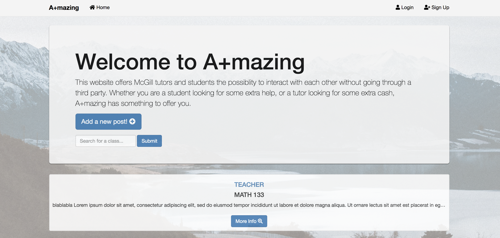
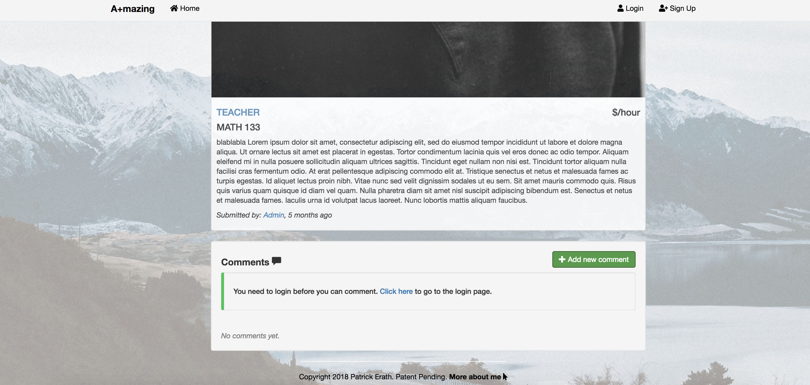

# Aplusmazing

As of now, this website uses HTML5, CSS3, JavaScript, Bootstrap and jQuery on the front-end. On the back-end, it uses NodeJS, NPM, ExpressJS, REST, Authorization/Authentication and PassportJS. In order to store data non-sequential Mongo DB was used. The application is currently hosted on Heroku servers with the help of MongoLab.

The link for the website is: 	**https://Aplusmazing.herokuapp.com**

